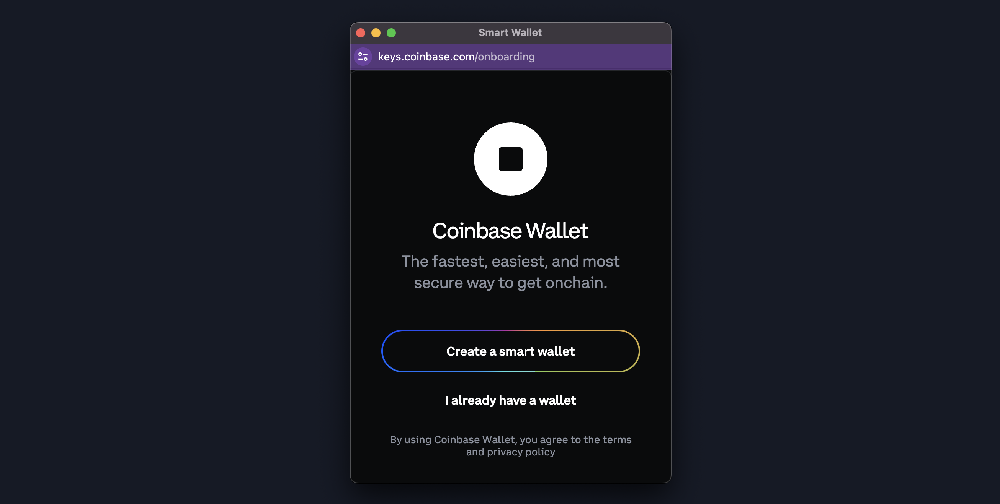
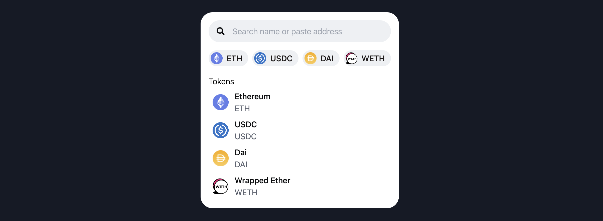
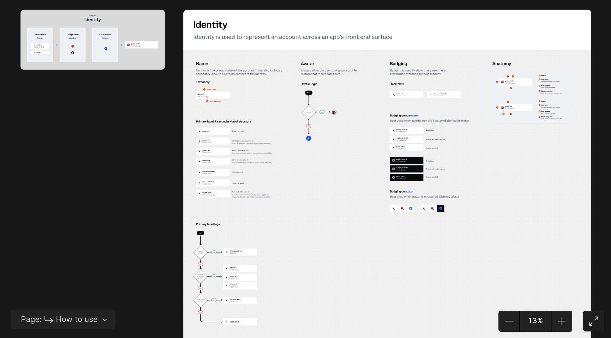
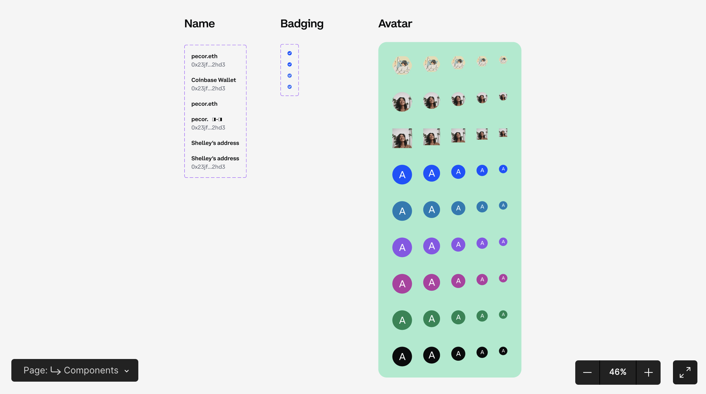

<p align="center">
  <a href="https://onchainkit.xyz">
    <picture>
      <source media="(prefers-color-scheme: dark)" srcset="./site/docs/public/logo/v0-21.png">
      
    </picture>
  </a>
</p>

# OnchainKit

<p align="left">
  React components and TypeScript utilities to help you build top-tier onchain apps.
<p>

<p align="left">
  <a href="https://www.npmjs.com/package/@coinbase/onchainkit" target="_blank" rel="noopener noreferrer">
    <picture>
      <source media="(prefers-color-scheme: dark)" srcset="https://img.shields.io/npm/v/@coinbase/onchainkit?colorA=21262d&colorB=21262d&style=flat">
      
    </picture>
  </a>
  <a href="https://github.com/coinbase/onchainkit/blob/main/LICENSE.md" target="_blank" rel="noopener noreferrer">
    <picture>
      <source media="(prefers-color-scheme: dark)" srcset="https://img.shields.io/npm/l/@coinbase/onchainkit?colorA=21262d&colorB=21262d&style=flat">
      
    </picture>
  </a>
  <a href="https://www.npmjs.com/package/@coinbase/onchainkit" target="_blank" rel="noopener noreferrer">
    <picture>
      <source media="(prefers-color-scheme: dark)" srcset="https://img.shields.io/npm/dm/@coinbase/onchainkit?colorA=21262d&colorB=21262d&style=flat">
      
    </picture>
  </a>
</p>

<br />

## Documentation

For documentation and guides, visit [onchainkit.xyz](https://onchainkit.xyz/).

## Quickstart

To integrate OnchainKit into your project, begin by installing the necessary packages.

```bash
# Yarn: Add library
yarn add @coinbase/onchainkit

# or

# Use NPM
npm install @coinbase/onchainkit

# Use PNPM
pnpm add @coinbase/onchainkit

# Use BUN
bun add @coinbase/onchainkit
```

## CSS

Add this at the top of your application entry point

```javascript
import "@coinbase/onchainkit/styles.css";
```

For tailwindcss users, use this [Tailwindcss Integration Guide](https://onchainkit.xyz/guides/tailwind).

## Components

#### Display ENS [avatars](https://onchainkit.xyz/identity/avatar), Attestation [badges](https://onchainkit.xyz/identity/badge), ENS [names](https://onchainkit.xyz/identity/name) and account [addresses](https://onchainkit.xyz/identity/address).

```tsx
const EAS_SCHEMA_ID = '0xf8b05c79f090979bf4a80270aba232dff11a10d9ca55c4f88de95317970f0de9';
const ACCOUNT_ADDRESS = '0x838aD0EAE54F99F1926dA7C3b6bFbF617389B4D9';

<OnchainKitProvider chain={base} schemaId={EAS_SCHEMA_ID}>
  <Identity>
    <Avatar />
      <Badge />
    </Avatar>
    <Name />
    <Address />
  <Identity>
</OnchainKitProvider>;
```

<picture>
  <source media="(prefers-color-scheme: dark)" srcset="./site/docs/public/assets/onchainkit-identity.png">
  
</picture>

#### Convert your web page into a [Frame](https://onchainkit.xyz/frame/frame-metadata)

```tsx
import { FrameMetadata } from '@coinbase/onchainkit/frame';

export default function HomePage() {
  return (
    ...
    <FrameMetadata
      buttons={[
        {
          label: 'Tell me the story',
        },
        {
          action: 'link',
          label: 'Link to Google',
          target: 'https://www.google.com'
        },
        {
          action: 'post_redirect',
          label: 'Redirect to cute pictures',
        },
      ]}
      image={{
       src: 'https://zizzamia.xyz/park-3.png',
       aspectRatio: '1:1'
      }}
      input={{
        text: 'Tell me a boat story',
      }}
      postUrl="https://zizzamia.xyz/api/frame"
    />
    ...
  );
}
```

#### Create or connect your wallet with [Connect Account](https://onchainkit.xyz/wallet/connect-account), powered by [Smart Wallet](https://www.smartwallet.dev/why).

```tsx
<div className="flex flex-grow">
  {(() => {
    if (status === "disconnected") {
      return <ConnectAccount />; // [!code focus]
    }
    return (
      <div className="flex h-8 w-8 items-center justify-center">
        <button type="button" onClick={() => disconnect()}>
          <Avatar address={address} />
        </button>
      </div>
    );
  })()}
</div>
```

<picture>
  <source media="(prefers-color-scheme: dark)" srcset="./site/docs/public/assets/onchainkit-wallet-1.png">
  
</picture>
<picture>
  <source media="(prefers-color-scheme: dark)" srcset="./site/docs/public/assets/onchainkit-wallet-2.png">
  
</picture>

#### Search [Tokens](https://onchainkit.xyz/token/types#token) using [getTokens](https://onchainkit.xyz/token/get-tokens) and display them with [TokenSearch](https://onchainkit.xyz/token/token-search), [TokenChip](https://onchainkit.xyz/token/token-chip), [TokenImage](https://onchainkit.xyz/token/token-image) and [TokenRow](https://onchainkit.xyz/token/token-row)

```tsx
const [filteredTokens, setFilteredTokens] = useState<Token[]>([]);

const handleChange = useCallback((value) => {
async function getData(value) {
const tokens: Token[] = await getTokens({ search: value }); // [!code focus]
setFilteredTokens(filteredTokens);
}
getData(value);
}, []);
...

<div className="flex flex-col gap-4 rounded-3xl bg-white p-4">
  <TokenSearch onChange={handleChange} delayMs={200} /> // [!code focus]
  {filteredTokens.length > 0 && (
    <div className="flex gap-2">
      {filteredTokens.map((token) => (
        <TokenChip key={token.name} token={token} onClick={handleSelect} /> // [!code focus]
      ))}
    </div>
  )}
  {filteredTokens.length > 0 ? (
    <div>
      <div className="text-body text-black">Tokens</div>
      <div>
        {filteredTokens.map((token) => (
          <TokenRow key={token.name} token={token} onClick={handleSelect} /> // [!code focus]
        ))}
      </div>
    </div>
  ) : (
    <div className="text-body text-black">No tokens found</div>
  )}
</div>
```

<picture>
  <source media="(prefers-color-scheme: dark)" srcset="./site/docs/public/assets/onchainkit-token.png">
  
</picture>

## Utilities

If you're seeking basic TypeScript utilities, we have plenty of ready-to-use options available.

##### Config

- [isBase](https://onchainkit.xyz/config/is-base)

##### Frames

- [getFrameHtmlResponse](https://onchainkit.xyz/frame/get-frame-html-response)
- [getFrameMessage](https://onchainkit.xyz/frame/get-frame-message)
- [getFrameMetadata](https://onchainkit.xyz/frame/get-frame-metadata)

##### Identity

- [getAvatar](https://onchainkit.xyz/identity/get-avatar)
- [getAttestations](https://onchainkit.xyz/identity/get-attestations)
- [getName](https://onchainkit.xyz/identity/get-name)
- [useName](https://onchainkit.xyz/identity/use-name)
- [useAvatar](https://onchainkit.xyz/identity/use-avatar)

##### Swap

- [getSwapQuote](https://onchainkit.xyz/swap/get-swap-quote)
- [buildSwapTransaction](https://onchainkit.xyz/swap/build-swap-transaction)

##### Token

- [formatAmount](https://onchainkit.xyz/token/format-amount)
- [getTokens](https://onchainkit.xyz/token/get-tokens)

##### Wallet

- [isValidAAEntrypoint](/wallet/is-valid-aa-entrypoint)
- [isWalletACoinbaseSmartWallet](/wallet/is-wallet-a-coinbase-smart-wallet)

##### Farcaster

- [getFarcasterUserAddress](https://onchainkit.xyz/farcaster/get-farcaster-user-address)

##### XMTP

- [getXmtpFrameMessage](https://onchainkit.xyz/xmtp/get-xmtp-frame-message)
- [isXmtpFrameRequest](https://onchainkit.xyz/xmtp/is-xmtp-frame-request)

## Design

All our component designs are open-sourced. You can access the [Figma file](https://www.figma.com/community/file/1370194397345450683) to use them for your onchain project.

<a href="https://www.figma.com/community/file/1370194397345450683">
  <p>Figma - How to use</p>
  <picture>
    <source media="(prefers-color-scheme: dark)" srcset="./site/docs/public/assets/onchainkit-figma-design-how-to-use.png">
    
  </picture>
  <p>Figma - Components</p>
  <picture>
    <source media="(prefers-color-scheme: dark)" srcset="./site/docs/public/assets/onchainkit-figma-design-components.png">
    
  </picture>
</a>

## Community ☁️ 🌁 ☁️

Check out the following places for more OnchainKit-related content:

- Follow [@onchainkit](https://x.com/Onchainkit) or [@zizzamia](https://github.com/zizzamia) ([X](https://twitter.com/zizzamia), [Warpcast](https://warpcast.com/zizzamia)) for project updates
- Join the discussions on our [OnchainKit warpcast channel](https://warpcast.com/~/channel/onchainkit)

## Authors

- [@zizzamia](https://github.com/zizzamia) ([X](https://twitter.com/hey_shells), [Warpcast](https://warpcast.com/zizzamia))
- [@0xchiaroscuro](https://github.com/0xchiaroscuro) ([X](https://twitter.com/chiaroscuro), [Warpcast](https://warpcast.com/chiaroscuro))
- [Ky Lee](https://github.com/kyhyco)
- [Tina He](https://github.com/fakepixels) ([X](https://twitter.com/fkpxls))
- [Mind Apivessa](https://github.com/mindapivessa) ([X](https://twitter.com/spicypaprika_))
- [Alec Chen](https://github.com/0xAlec) ([X](https://twitter.com/0xAlec))
- [Alissa Crane](https://github.com/abcrane123) ([X](https://twitter.com/abcrane123))
- [Paul Cramer](https://github.com/cpcramer) ([X](https://twitter.com/PaulCramer_))

## License

This project is licensed under the MIT License - see the [LICENSE.md](LICENSE.md) file for details
