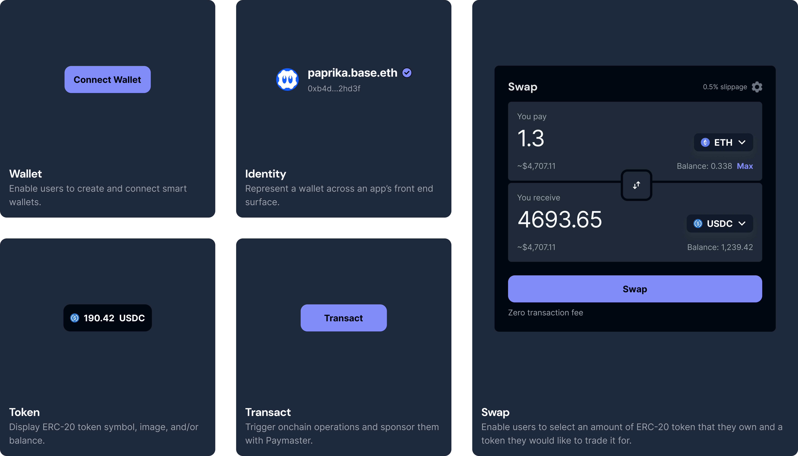

<div align="center">
  <p>
    <a href="https://onchainkit.xyz">
      
    </a>
  </p>

  <h1 style="font-size: 3em; margin-bottom: 20px;">
    OnchainKit
  </h1>

  <p style="font-size: 1.2em; max-width: 600px; margin: 0 auto 20px;">
    React components and TypeScript utilities to help you build top-tier onchain apps.
  </p>

<p>
  <a href="https://www.npmjs.com/package/@coinbase/onchainkit" target="_blank" rel="noopener noreferrer">
    
  </a>
  <a href="https://github.com/coinbase/onchainkit/commits/main">
    
  </a>
  <a href="https://www.npmjs.com/package/@coinbase/onchainkit" target="_blank" rel="noopener noreferrer">
    
  </a>
  <a href="https://onchainkit.xyz/coverage">
    
  </a>
  <a href="https://github.com/coinbase/onchainkit/blob/main/LICENSE.md" target="_blank" rel="noopener noreferrer">
    
  </a>
</p>

<p>
  <a href="https://x.com/OnchainKit">
    
  </a>
  <a href="https://discord.gg/invite/cdp">
      
  </a>
  <a href="https://github.com/coinbase/onchainkit/stargazers">
    
  </a>
  <a href="https://github.com/coinbase/onchainkit/network/members">
    
  </a>
</p>
</div>

<br />

## 🚀 Quickstart

Run `npm create onchain` to bootstrap an example onchain app with all the batteries included.

## ✨ Documentation

For documentation and guides, visit [onchainkit.xyz](https://onchainkit.xyz/).

## 📊 API Stability

OnchainKit follows semantic versioning. Here's the stability status of each module:

### Stable APIs
These APIs are production-ready and follow semantic versioning. Breaking changes only occur in major versions.

| Module | Components | Hooks | Status |
|--------|------------|-------|--------|
| **Identity** | `Address`, `Avatar`, `Badge`, `EthBalance`, `Identity`, `IdentityCard`, `Name`, `Socials` | `useAddress`, `useAvatar`, `useName`, `useAttestations` | ✅ Stable |
| **Wallet** | `Wallet`, `ConnectWallet`, `WalletDropdown`, `WalletDropdownLink`, `WalletDropdownDisconnect` | `useWalletContext`, `usePortfolio` | ✅ Stable |
| **Transaction** | `Transaction`, `TransactionButton`, `TransactionStatus`, `TransactionStatusLabel`, `TransactionStatusAction` | `useTransactionContext` | ✅ Stable |
| **Swap** | `Swap`, `SwapAmountInput`, `SwapButton`, `SwapMessage`, `SwapToggleButton` | `useSwapContext` | ✅ Stable |
| **Fund** | `FundButton`, `FundCard` | `useFundContext` | ✅ Stable |
| **Token** | `TokenChip`, `TokenImage`, `TokenRow`, `TokenSearch`, `TokenSelectDropdown` | — | ✅ Stable |

### Evolving APIs
These APIs are stable but may receive non-breaking enhancements. Safe for production use.

| Module | Components | Status |
|--------|------------|--------|
| **Buy** | `Buy`, `BuyButton`, `BuyDropdown` | ⚡ Evolving |
| **Earn** | `Earn`, `EarnCard`, `EarnDetails` | ⚡ Evolving |
| **NFT** | `NFTCard`, `NFTMintCard`, `NFTCollectionTitle` | ⚡ Evolving |
| **MiniKit** | MiniKit utilities and hooks | ⚡ Evolving |

### Experimental APIs
These APIs may change significantly. Use with caution in production.

| Module | Status | Notes |
|--------|--------|-------|
| **Appchain Bridge** | 🧪 Experimental | New bridging functionality |
| **Signature** | 🧪 Experimental | Signature request components |

### Deprecated APIs
These APIs are scheduled for removal. Migrate to recommended alternatives.

| API | Status | Alternative |
|-----|--------|-------------|
| **Checkout** | ⚠️ Deprecated | Use `Transaction` component |
| **MiniKitProvider** | ⚠️ Deprecated | Use `OnchainKitProvider` with `miniKit` prop |

## 🛠️ Contributing

### Overview

This project is set up as a monorepo with pnpm workspaces.

### Requirements

- Node.js v20
- pnpm v10

### Getting Started

1. Clone the repository

```bash
git clone https://github.com/coinbase/onchainkit.git
```

2. Install dependencies

```bash
pnpm install
```

### Running packages

To run a script in a single package, use the following command:

```bash
pnpm [-F | --filter] <package-name> <script-name>
```

To run a script in all packages, use the following command:

```bash
pnpm run <script-name>
```

### Shorthands

We provide shorthands to filter by project in the root `package.json`.

The following shorthands are available:

- `pnpm f:ock`: `pnpm --filter @coinbase/onchainkit`
- `pnpm f:play`: `pnpm --filter playground`
- `pnpm f:create`: `pnpm --filter create-onchain`
- `pnpm f:manifest`: `pnpm --filter miniapp-manifest-generator`

### Development

When working on components, you can build OnchainKit in watch mode and start the playground to view your components with the following command:

```bash
pnpm f:play dev:watch
```

Then, you can view the playground at [http://localhost:3000](http://localhost:3000).


## 🌁 Team and Community

- **OnchainKit** ([X](https://x.com/Onchainkit), [Warpcast](https://warpcast.com/onchainkit))
- [Tina He](https://github.com/fakepixels) ([X](https://x.com/fkpxls))
- [Mind Apivessa](https://github.com/mindapivessa) ([X](https://x.com/spicypaprika_))
- [Alissa Crane](https://github.com/abcrane123) ([X](https://x.com/abcrane123))
- [Alec Chen](https://github.com/0xAlec) ([X](https://x.com/0xAlec))
- [Paul Cramer](https://github.com/cpcramer) ([X](https://x.com/PaulCramer_))
- [Shelley Lai](https://github.com/0xchiaroscuro) ([X](https://x.com/hey_shells), [Warpcast](https://warpcast.com/chiaroscuro))
- [Léo Galley](https://github.com/kirkas) ([X](https://x.com/artefact_lad))
- [Adam Lessey](https://github.com/alessey) ([X](https://x.com/alessey))

## 💫 Contributors

<a href="https://github.com/coinbase/onchainkit/graphs/contributors">
  
</a>

## 🌊 License

This project is licensed under the MIT License - see the [LICENSE.md](LICENSE.md) file for details
